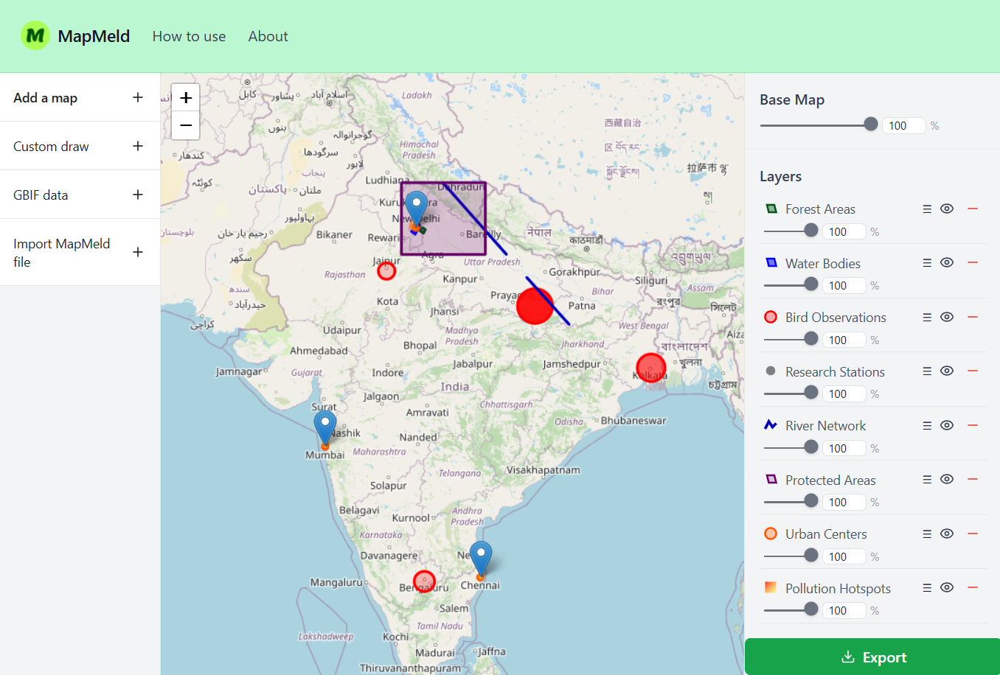
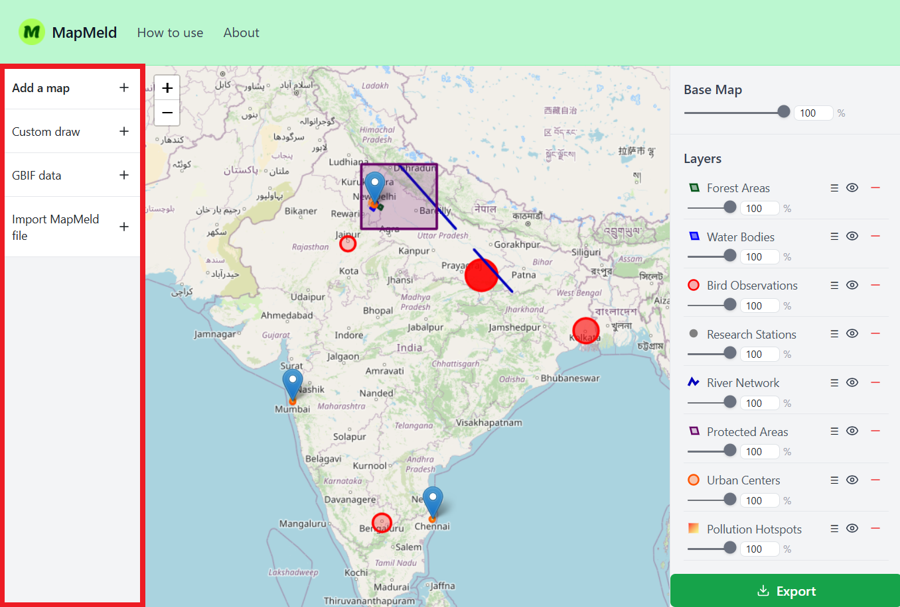
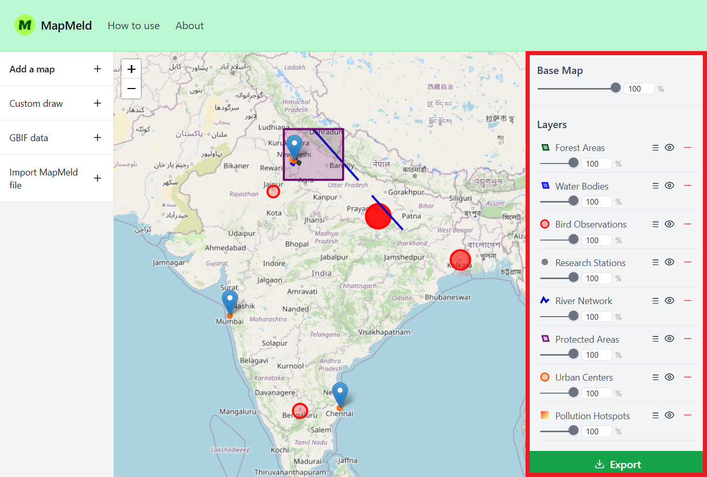
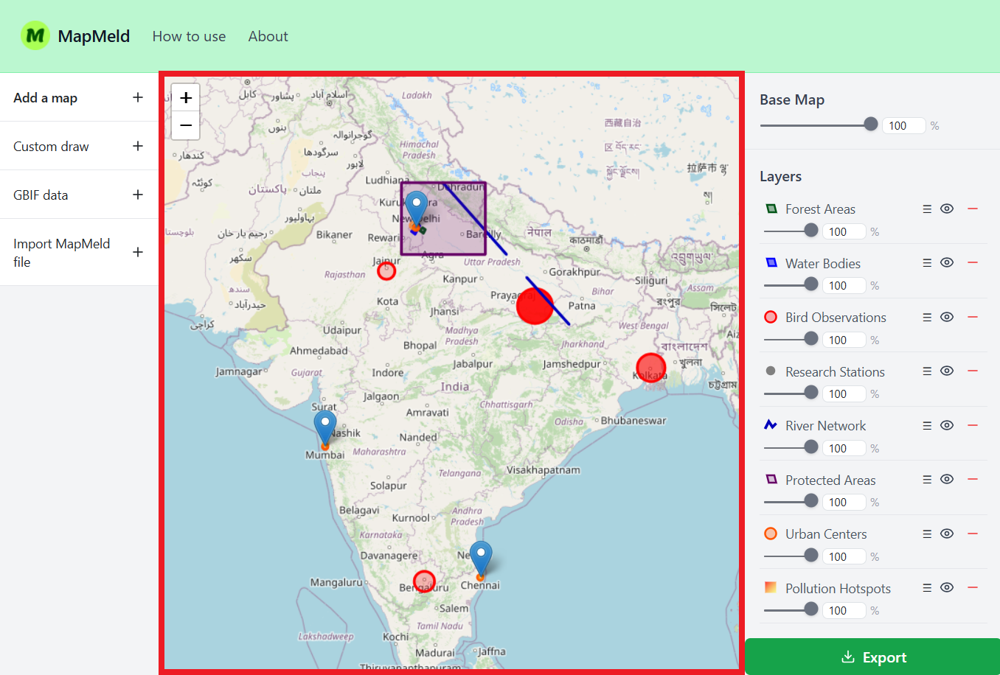

# MapMeld India: Synthesising Spatial Data for Actionable Insights

MapMeld is a tool designed for *comparing different types of maps*, like those showing national weather, forest, and species distribution data, which helps to compare various Indian maps by overlaying them.

MapMeld overlays two or more maps such that the user can view all with equal opacity to notice the relative placement of various objects present in all the maps. This can be used for understanding and analysing trends and correlations across several biodiversity factors.

## Getting Started

To access the tool, you can visit [https://shrutimone.github.io/MapMeld](https://shrutimone.github.io/MapMeld)

This is the home page of MapMeld - 

This is the Left-side Sidebar, from where different types of Maps can be added and file can be opened.

This is the Right-side Sidebar, from where the layers can be controlled and MapMeld file can be exported.

Finally, this is the actual map which you can view and control through various functionalities.

